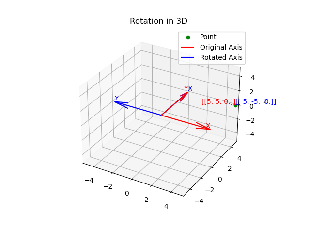
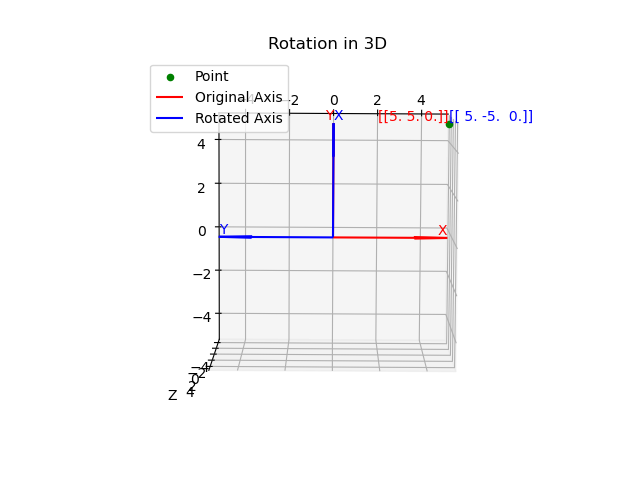
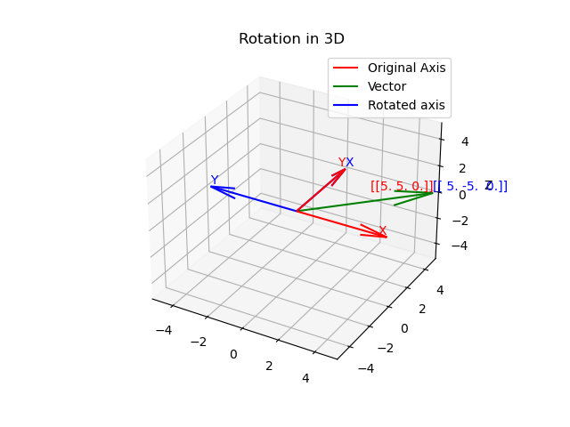

# Coordinate Transformations

# Description
This code is designed to take in a vector or a point in 3D space and apply a rotation and/or a translation. This helps the user see the vector or point in a different coordinate plane. It should be noted, the program will only rotate the object in the xy plane. To rotate in the z plane, the rotation matrix would need to be adjusted.

The main file is `rotational.py`. This file contains the functions to rotate and translate the object. It is a single file that can be run from Python in the command line or used in a larger project via import. The `images` folder contains the images used in this README. Instructions on how to run the program are contained below. When used, the program is given the original points, translation, and rotation angle desired. The program will then output the original object and the rotated and/or translated object on the same graph. This enables the user to see the effects of the transforms on the same graph.

# Install Instructions
## Creating and activating a Python virtual environment
This step is not required. All installation can be done outside the virtual environment. It should be assumed that the python virtual environment is located at the same level as the `rotations` folder and is named `venv`. Navigate the terminal to the parent of `rotations` and run the following command:

```
python -m venv venv
```
You may need to replace `python` with `python3` or `python3.10`.

If successful, the `venv` should have been created. **Each time you open a terminal, you must activate the virtual environment**. From the parent folder, activate the virtual environment with the following command:

```
Windows:
venv\Scripts\activate

Ubuntu:
source venv/bin/activate
```

## Installing the `rotational` package
The `rotational` package is setup to be installed using the `pip` package installer. To install the `rotational` package, activate the `venv` virtual environment (if desired), navigate to the parent directory of the `rotational` code, and run the following.
```
pip install -e .
```
The `-e` option allows the Python code to be modified without the need to rerun the installation. The `requirements.txt` file defines all of the package dependencies. The `setup.py` file defines the creation of the `rotational` package.

# Using the `rotational` Package
The `rotational` package is designed to be used in a larger project or in the `CLI` Python interface. The `rotational` package can be imported into a Python file using the following command after installing:
```
import rotational
```
The `rotational` package can be run from the command line or used in a larger program using the following commands:
```
rotational.point("point vector", "translation vector", "rotation angle")

rotational.vector("vector head", "translation vector", "rotation angle")
```
It should be noted that all vectors are in xyz coordinates. 

# Running Compliance Tests Instructions
1. pip install pylint mypy isort 
2. pylint rotational.py && mypy rotational.py && isort rotational.py

An effort has been made to comply with the coding standards of pylint, mypy, and isort. The above commands will run the compliance tests. The `rotational.py` file should pass all tests. The Black code formatter was used to format the code.

# Visuals
These visuals are of different coordinate transforms. It should be noted that the transforms are based off the origin in all cases. This is because we are rotating and/or translating the coordinate frame, not the object. This makes it easier to see the effects of the transforms on the same graph as the original coordinate frame is always at the center of the graph. 

### The first and second images are the point (5,5,0) rotated 90&deg; in the xy plane.<br>




### The third and fourth images are a vector with length (5,5,0) rotated 90&deg; in the xy plane.<br>




### The fifth and sixth images are a point translated by (5,5,0) in the xy plane.<br>

 in the xy plane")
 in the xy plane")

### The seventh and eighth images are a coordinate frame with a vector of length (3,3,0) translated by (5,5,0) in the xy plane.<br>

 in the xy plane")
 in the xy plane")

### The ninth and tenth images are a point at (3,3,0) rotated 90&deg; in the xy plane and then translated by (5,5,0) in the xy plane.<br>

 in the xy plane")
 in the xy plane")

### The eleventh and twelfth images are a coordinate frame with a vector of length (3,3,0) rotated 90&deg; in the xy plane and then translated by (5,5,0) in the xy plane.<br>

 in the xy plane")
 in the xy plane")


## Authors and acknowledgment
By David Rowbotham

## License
GNU GENERAL PUBLIC LICENSE
Version 3, 29 June 2007
 

